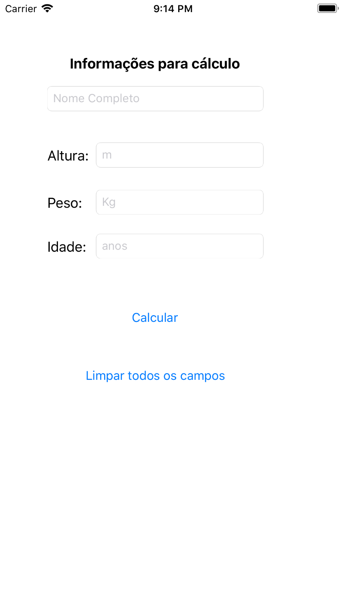
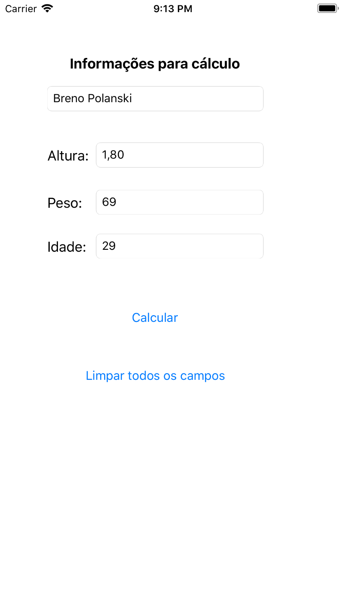
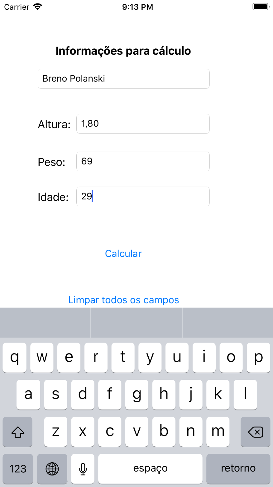
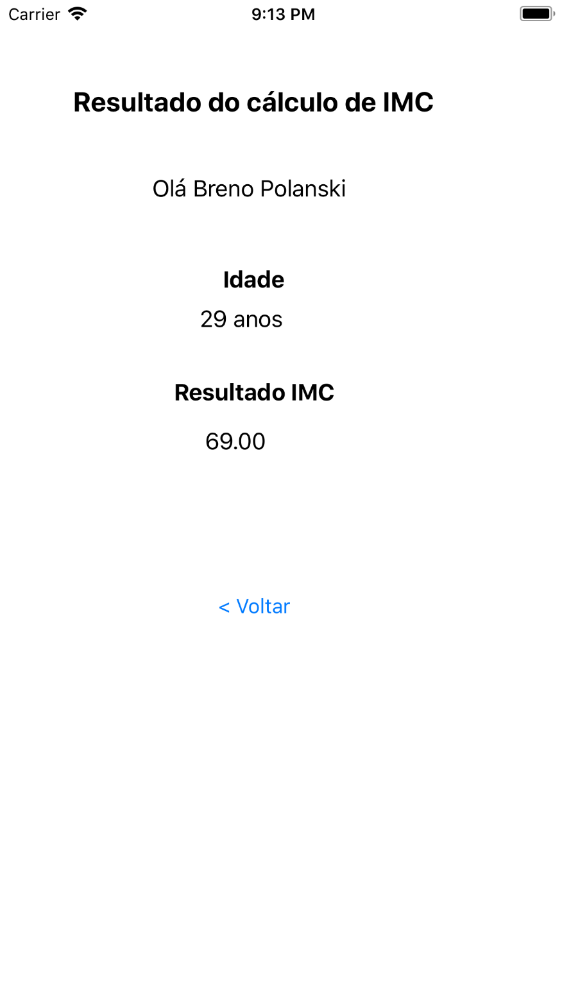

# Calculate BMI Rate

> iOS (Swift) application to calculate the BMI rate

## Screenshots

|  |  |  |
| :---: | :---: | :---: |
| Information for Calculation | Alert | Completed Form |

|  |  |
| :---: | :---: |
| Show Keyboard | Result Screen |

## Developers

- [@brenopolanski](https://github.com/brenopolanski)
- [@inaciofabricio](https://github.com/inaciofabricio)

## Credits

Inspired by article: [Criando um app para iOS com Swift](https://medium.com/thdesenvolvedores/criando-um-app-para-ios-com-swift-4774505862f1)

## License

[MIT License](http://brenopolanski.mit-license.org/) © Breno Polanski
